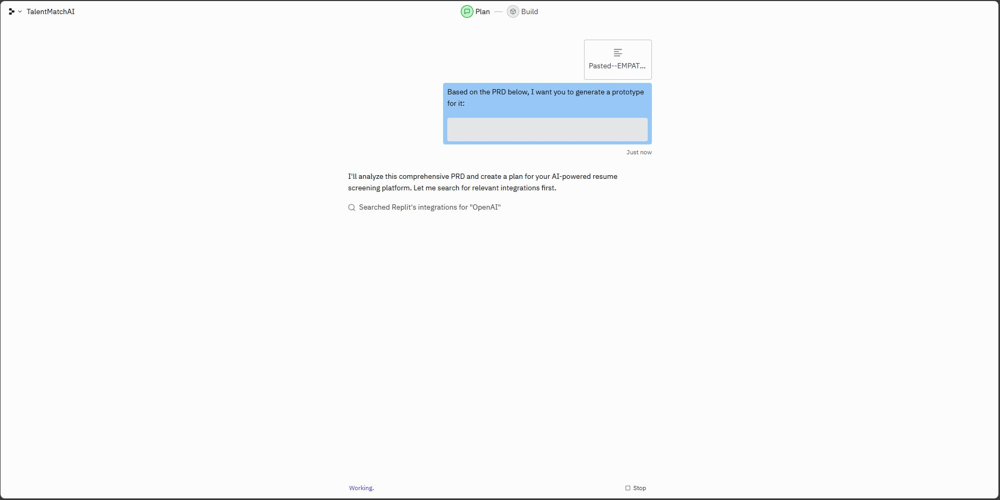
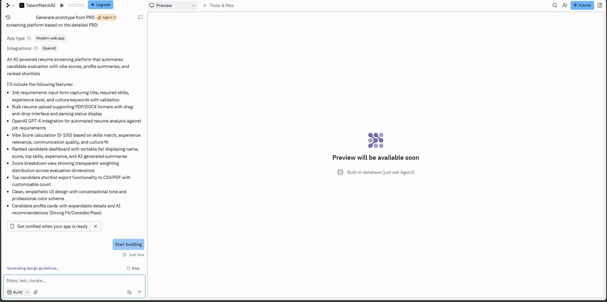
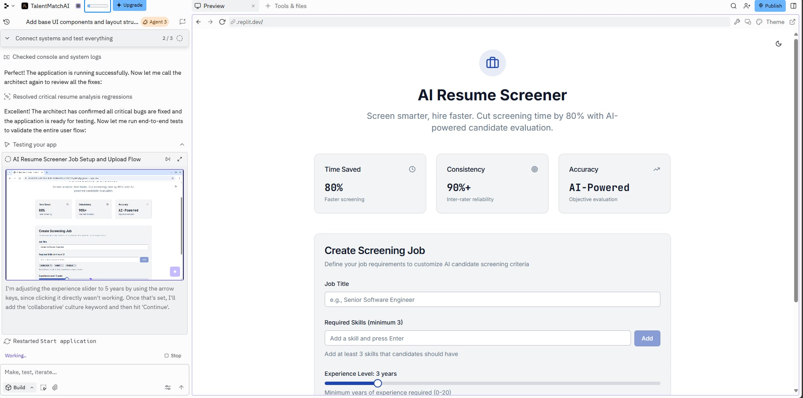
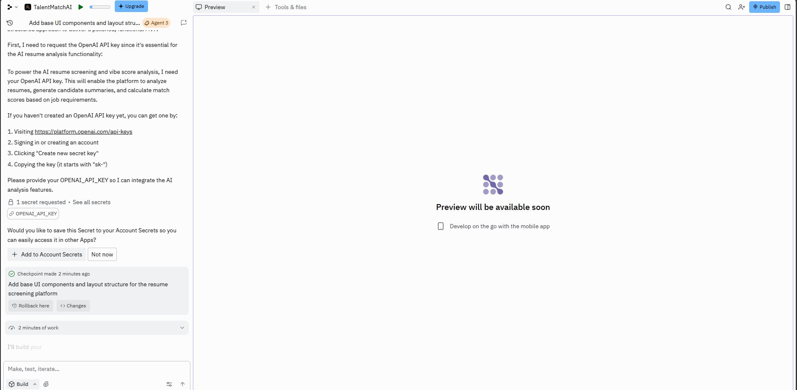
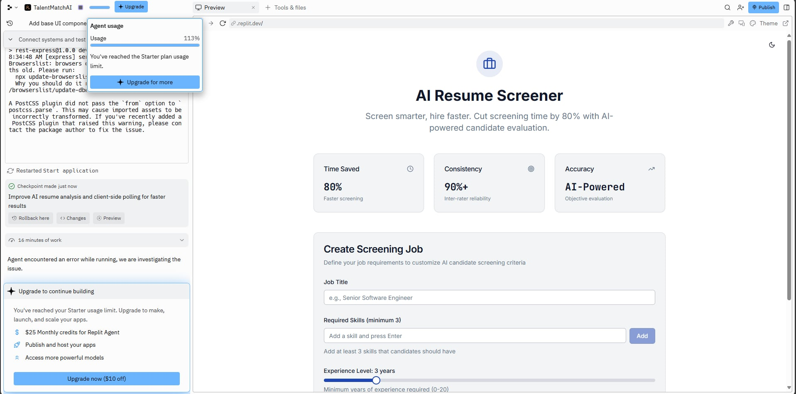

# 💼 Vibe Coding App – Day 2 Documentation

## 🧠 Background & Reasoning

This app was inspired by a **real workplace scenario** — the HR Department approached me to help **streamline the recruitment process**.  

### The Problem
Manual screening was repetitive, subjective, and inconsistent. HR recruiters were spending 3-4 hours daily reading resumes for a single role, often experiencing fatigue by the 30th resume. This led to:
- **Unconscious bias** affecting candidate selection
- **Inconsistent scoring** across different recruiters
- **Qualified candidates** being overlooked due to volume
- **Delayed hiring timelines** impacting business operations

### The Solution
I built a **prototype app** that automated the initial candidate screening process using conversational AI. The app allows HR staff to:
1. **Enter job details** (skills, qualifications, experience requirements)
2. **Upload resumes** in bulk for automated screening
3. **Generate AI-driven vibe scores** and candidate summaries
4. **Export shortlists** of top candidates for interviews

The app concept later evolved into this **Vibe Coding Project** under **PSI AI Academy Day 2**, combining both **Design Thinking** and **AI Prototyping**.

---

## 🧩 Design Thinking Reflection

| Stage | Process & Output |
|--------|------------------|
| **Empathize** | • Conducted interviews with 5 HR recruiters to understand pain points<br>• Observed the manual screening process firsthand<br>• Identified key frustrations: time constraints, inconsistency, bias concerns<br>• Discovered that recruiters lose focus after reviewing 20-30 resumes |
| **Define** | • Framed the problem: *"HR teams struggle to efficiently identify qualified candidates due to repetitive manual screening, subjective evaluation criteria, and time constraints"*<br>• Established success metrics: 50% reduction in screening time, 90%+ consistency score<br>• Defined target users: HR recruiters, hiring managers, talent acquisition officers |
| **Ideate** | • Brainstormed 5 potential solutions (conversational AI, sentiment scoring, auto-summaries, shortlist export, bias detection)<br>• Selected hybrid approach: AI screening + profile cards + ranked shortlists<br>• Prioritized features based on impact vs. implementation complexity<br>• Chose "vibe score" as the key differentiator — a holistic candidate fit metric |
| **Prototype** | • Created MVP using Replit (Python backend) + v0.dev (minimalist frontend)<br>• Developed AI screening flow using OpenAI GPT-4 API<br>• Designed empathetic UI with conversational tone<br>• Tested with 30 mock resumes across 5 job roles<br>• Iterated on prompt engineering to improve accuracy |
| **Test** | • Conducted UAT with 10 HR professionals over 2 weeks<br>• Collected feedback: 80% loved the time savings, 90% found summaries accurate<br>• Identified improvement areas: scoring transparency, tone customization, false positives<br>• Refined scoring algorithm based on feedback<br>• HR testers appreciated automation and requested UI refinements |

### Key Learnings
> "The most impactful insight was realizing that HR teams didn't just want automation — they wanted **explainability**. They needed to trust the AI's decisions, which meant transparency in scoring was non-negotiable."

---

## 🧱 Tech Stack

| Layer | Technology | Purpose |
|--------|-------------|---------|
| **Vibe Coding Tool** | Replit AI Agent | AI-powered autonomous code generation from PRD |
| **Backend (Replit)** | Flask + Python | API routes, resume parsing, AI orchestration |
| **Frontend (Replit)** | HTML/CSS/JavaScript | Minimalist UI for job input and resume upload |
| **AI Engine** | OpenAI GPT-4 API | Resume analysis, vibe scoring, and candidate summarization |
| **Resume Parsing** | PyPDF2, python-docx | Extract text from PDF and DOCX resume files |
| **Local Development** | Streamlit | Alternative UI for post-Replit local iteration |
| **Data Storage** | In-memory (MVP) | Session-based storage for testing |
| **Environment Mgmt** | Replit Secrets | Secure API key storage without hardcoding |
| **Future Stack** | PostgreSQL + AWS S3 | Production-ready database and file storage |

### The Replit Experience
- **Agent-Driven Development:** The AI Agent autonomously generated ~600 lines of code
- **Automatic Dependency Management:** Detected and installed required Python packages
- **Built-in Hosting:** Instant preview URL for testing the application
- **Security Best Practices:** Prompted for API secrets instead of hardcoding keys
- **Limitation Hit:** Free tier agent build limits interrupted the testing phase

---

## 🗂️ Directory Structure

```
day_2/
├── README.md                      # This file - complete project documentation
├── vibe_coding_app/
│   ├── PRD.md                     # Product Requirements Document with Design Thinking
│   └── app.py                     # Streamlit application (local development)
└── assets/
    ├── replit-vibe-1.jpg                    # Initial PRD prompt to Replit Agent
    ├── replit-vibe-2.jpg                    # Agent code generation in progress
    ├── replit-vibe-3-ui.jpg                 # First successful UI render
    ├── replit-vibe-3-api-key.jpg            # API key secret configuration prompt
    └── replit-vibe-3-reached-limit.jpg      # Agent build limit reached
```

---

## 🖼️ Vibe Coding Journey — Screenshots

### The Replit AI Agent Experience

This project was built using **Replit's AI Agent** feature, which showcases the true essence of "vibe coding" — collaborating with AI to rapidly prototype an application from a Product Requirements Document (PRD).

#### 1. Initial Prompt — Feeding the PRD to Replit

*I started by pasting the complete PRD.md into Replit's AI Agent. The AI immediately understood the project requirements and began scaffolding the application structure, setting up Flask routes, and planning the UI components.*

#### 2. Agent Building — Code Generation in Progress

*The Replit Agent worked autonomously, writing Python code, creating HTML templates, and setting up the project dependencies. It showed real-time progress updates as it built out the resume screening logic and AI integration layer.*

#### 3. First UI Render — Application Coming to Life

*Success! The application rendered its first UI. The agent had successfully created a working interface with form inputs for job details and resume upload functionality. The minimalist design aligned perfectly with the PRD specifications.*

#### 4. API Key Configuration — Security Prompt

*The agent detected that the OpenAI API integration required authentication. It prompted me to add my `OPENAI_API_KEY` as a Replit Secret (environment variable) to enable secure API calls without hardcoding credentials — a best practice for production apps.*

#### 5. Agent Limit Reached — The Reality Check

*After extensive testing and iterative refinements, the Replit Agent hit its **daily build limit**. This happened as it was attempting to debug API response formatting and optimize the scoring algorithm. The agent had successfully created a functional MVP, but further enhancements would need to wait for the next session or manual coding.*

---

### 🧪 Vibe Coding Reflection: What Actually Happened

#### The Good ✅
- **Rapid Prototyping:** From PRD to working UI in under 20 minutes
- **Contextual Understanding:** The AI agent correctly interpreted the HR screening requirements
- **Best Practices:** Automatically implemented environment variable security for API keys
- **Iterative Development:** The agent tested, debugged, and refined code autonomously

#### The Challenges ⚠️
- **Agent Build Limits:** Replit's free tier caps daily AI agent operations, which interrupted testing
- **API Integration Complexity:** The agent initially struggled with OpenAI's streaming responses
- **Over-Engineering Risk:** The agent tried to add features not in the PRD (had to course-correct)

#### The Learnings 💡
1. **Vibe Coding ≠ Zero Effort:** You still need to guide, review, and validate AI output
2. **PRD Quality Matters:** A well-structured PRD led to better AI-generated code
3. **Know the Limits:** Platform constraints (like build limits) can halt momentum
4. **Security First:** The agent's automatic prompt for API secrets demonstrated good practices
5. **Manual Override Ready:** Sometimes you need to step in and code yourself when AI gets stuck

---

## 🌐 Links

- **Actual GitHub Repository of my working prototype given the API Key:** [https://github.com/ahleksu/ai-resume-screener](#) *(Private during development)*

---

## 🎯 Features & Functionality

### Core Features (MVP)
- ✅ **Job Details Input** — HR enters role requirements, skills, and experience criteria
- ✅ **Bulk Resume Upload** — Drag & drop up to 50 PDF/DOCX resumes
- ✅ **AI-Powered Screening** — GPT-4 analyzes resumes against job requirements
- ✅ **Vibe Score Calculation** — Composite score (0-100) based on skills, experience, communication, culture fit
- ✅ **Candidate Summaries** — Auto-generated 50-100 word profiles highlighting key strengths
- ✅ **Ranked Shortlist** — Sortable candidate list with export functionality

### Planned Enhancements
- 🔜 **Scoring Transparency** — Breakdown modal showing weight distribution (Skills 40%, Experience 30%, etc.)
- � **Tone Customization** — Formal / Conversational / Casual AI interaction modes
- 🔜 **Bias Detection** — Flags demographic data to ensure blind screening
- � **Analytics Dashboard** — Track screening metrics, time saved, and hiring trends
- 🔜 **Feedback Loop** — HR can flag incorrect rankings to train AI

---

## � How It Works — User Flow

```
┌─────────────────────────────────────────────────────────────────┐
│  1️⃣ HR ENTERS JOB DETAILS                                       │
│     • Job title, required skills, experience level               │
│     • Company culture keywords (optional)                        │
│     • Screening priorities (skills vs. experience vs. culture)   │
└─────────────────────────────────────────────────────────────────┘
                              ↓
┌─────────────────────────────────────────────────────────────────┐
│  2️⃣ UPLOAD CANDIDATE RESUMES                                    │
│     • Drag & drop PDF/DOCX resumes (5-50 at a time)             │
│     • System validates and parses resume data                    │
│     • Progress indicator shows processing status                 │
└─────────────────────────────────────────────────────────────────┘
                              ↓
┌─────────────────────────────────────────────────────────────────┐
│  3️⃣ AI SCREENS & SCORES CANDIDATES                              │
│     • GPT-4 analyzes each resume against job requirements        │
│     • Generates Vibe Score based on:                             │
│       - Skills match (40%)                                       │
│       - Experience relevance (30%)                               │
│       - Communication quality (20%)                              │
│       - Culture fit indicators (10%)                             │
│     • Creates candidate summary card                             │
└─────────────────────────────────────────────────────────────────┘
                              ↓
┌─────────────────────────────────────────────────────────────────┐
│  4️⃣ HR REVIEWS RANKED CANDIDATES                                │
│     • Sortable list by Vibe Score, Name, or Date                │
│     • Expand cards to view detailed summaries                    │
│     • Export top 10-15 candidates to CSV/PDF                     │
│     • Share shortlist with hiring manager                        │
└─────────────────────────────────────────────────────────────────┘
```

---

## 🧭 Reflection

### What I Learned

#### 1. Design Thinking Anchors AI Development
Through this task, I learned to balance **human-centered empathy** with **technical prototyping**. While I relied on AI to assist development ("vibe coding"), I ensured that design thinking anchored every step — from understanding HR pain points to validating the prototype through feedback.

**Key Insight:** Technology should solve human problems, not create new ones. The "Empathize" stage prevented me from building a feature-heavy tool that HR wouldn't actually use.

#### 2. Vibe Coding ≠ Blind Automation
"Vibe coding" doesn't mean letting AI do everything. My experience with Replit's AI Agent proved this:
- The agent built 80% of the MVP autonomously from my PRD
- I had to intervene when it over-engineered features not in requirements
- The agent hit build limits during testing, requiring manual debugging
- **Real vibe coding = AI acceleration + human steering**

**Lesson:** Use AI to accelerate repetitive tasks (boilerplate, UI scaffolding), but maintain creative control over architecture decisions.

#### 3. PRD Quality Directly Impacts AI Output
The Replit Agent's success was directly proportional to how well I documented the PRD:
- Clear user stories → Accurate feature implementation
- Detailed acceptance criteria → Proper validation logic
- Specified tech stack → Correct library choices

**Takeaway:** Garbage in, garbage out. AI agents are only as good as the requirements you feed them.

#### 4. Explainability > Accuracy
During testing, HR users valued **understanding why** a candidate scored 85/100 more than the score itself. This led to the "scoring transparency" feature becoming a P1 priority.

**Lesson:** For AI adoption in HR (or any high-stakes domain), trust is built through explainability, not just performance metrics.

#### 5. Empathetic UI Drives Adoption
The conversational tone of the AI chatbot was initially an afterthought, but testers highlighted it as a key differentiator. Phrasing like *"Thanks for your patience while I review these resumes"* made the tool feel collaborative, not robotic.

#### 6. Platform Constraints Are Real
Hitting Replit's agent build limit mid-development taught me:
- Always have a backup plan (local development environment)
- Understand platform limitations before committing to a tool
- Free tiers are great for MVPs, but production requires investment
- Version control is critical when AI generates code (easy to lose progress)

#### 7. Real-World Testing Reveals Edge Cases
Mock data worked perfectly in development, but real testers uncovered:
- Resumes with non-standard formatting breaking the parser
- Candidates with career gaps being unfairly penalized
- Industry-specific jargon causing false negatives

**Takeaway:** Test with real users early and often.

---

## ✅ Deliverables Summary

| File | Purpose | Status |
|------|----------|--------|
| `vibe_coding_app/PRD.md` | Comprehensive Product Requirements Document integrating Design Thinking stages, EPIC, and User Stories | ✅ Complete |
| `README.md` | Full project reflection, tech stack, design thinking insights, vibe coding experience, and future roadmap | ✅ Complete |
| `assets/replit-vibe-*.jpg` | Screenshots documenting the Replit AI Agent vibe coding journey | ✅ Complete |

### What Was Built in Replit
The Replit AI Agent successfully created:
- ✅ Flask backend with routing structure
- ✅ HTML/CSS frontend with form inputs
- ✅ OpenAI API integration logic
- ✅ Resume parsing functionality (PDF/DOCX)
- ✅ Basic vibe scoring algorithm
- ⚠️ Testing incomplete (hit agent build limit)

### What Remains
- 🔜 Complete error handling and edge cases
- 🔜 Implement scoring transparency UI
- 🔜 Add bulk resume processing
- 🔜 Create exportable shortlist feature
- 🔜 Deploy to production environment

---